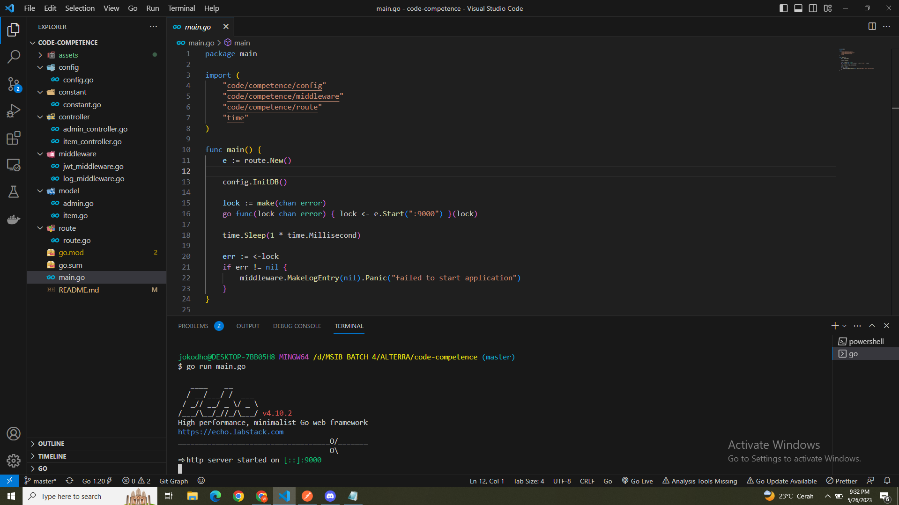
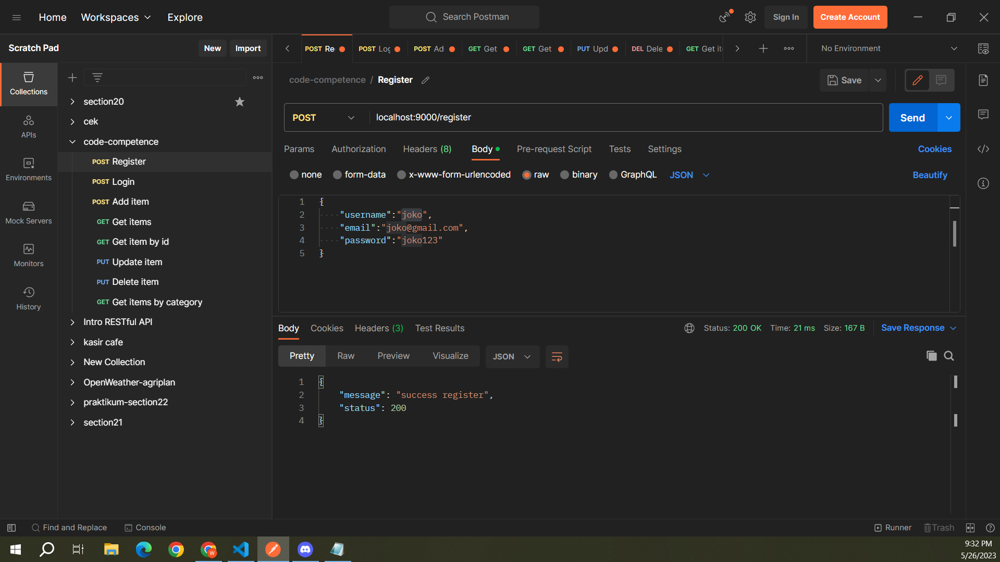
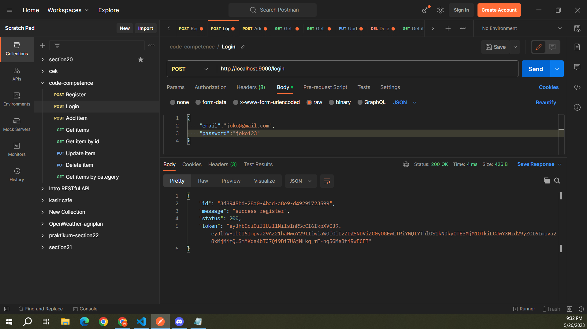
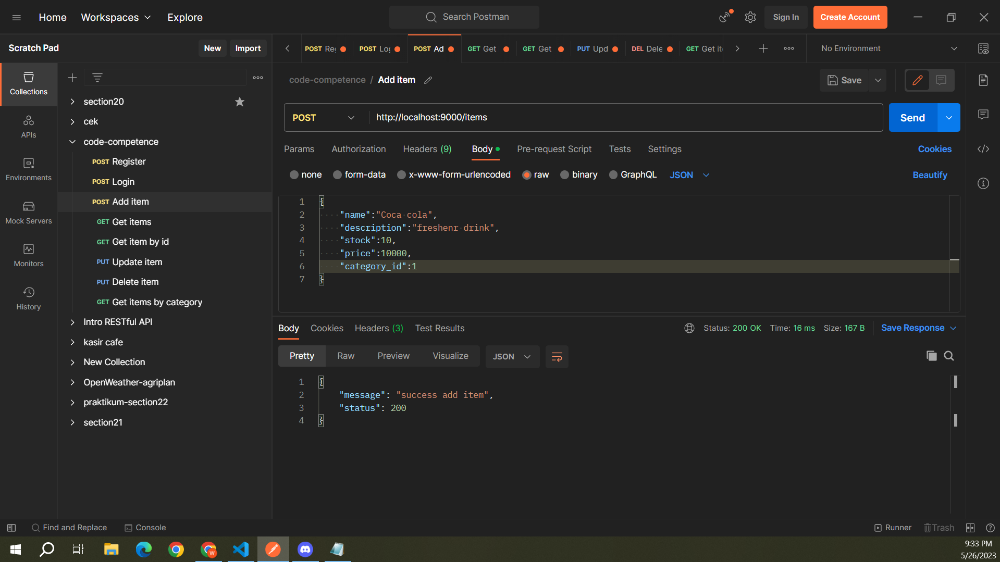
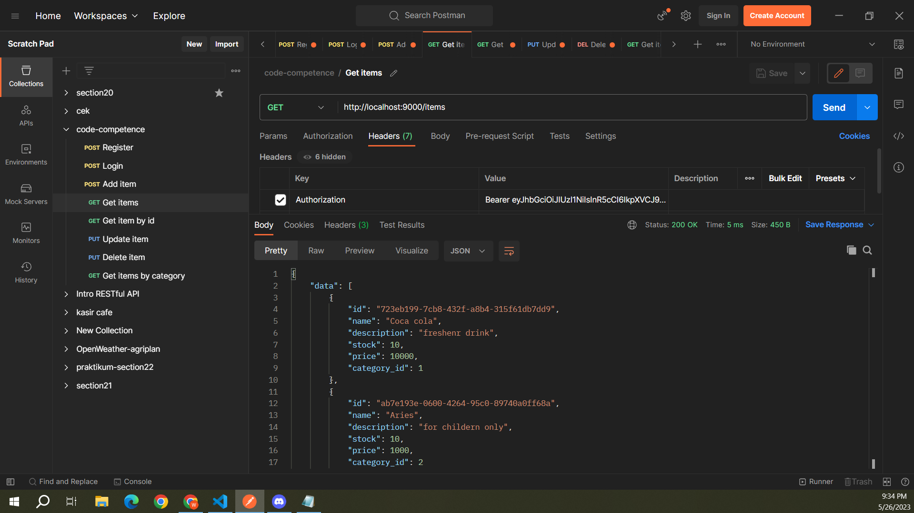
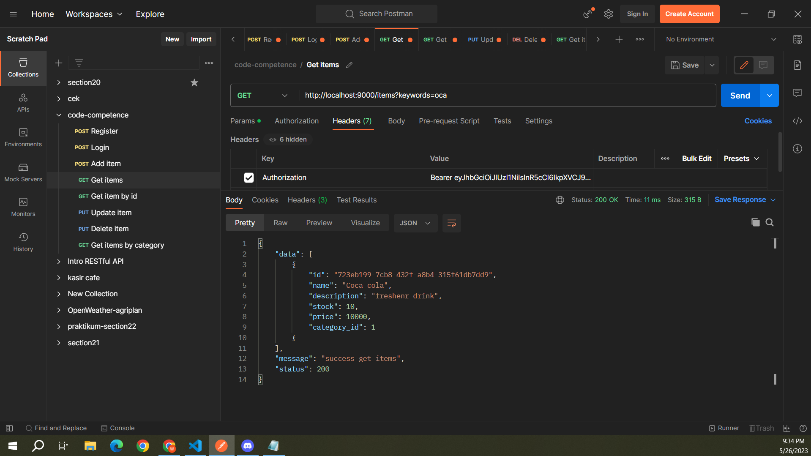
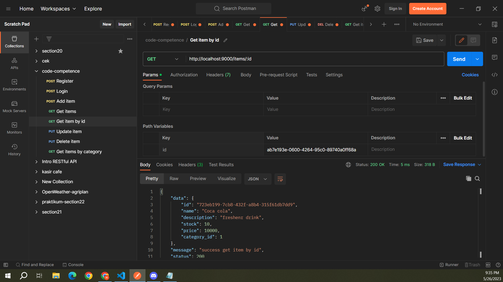
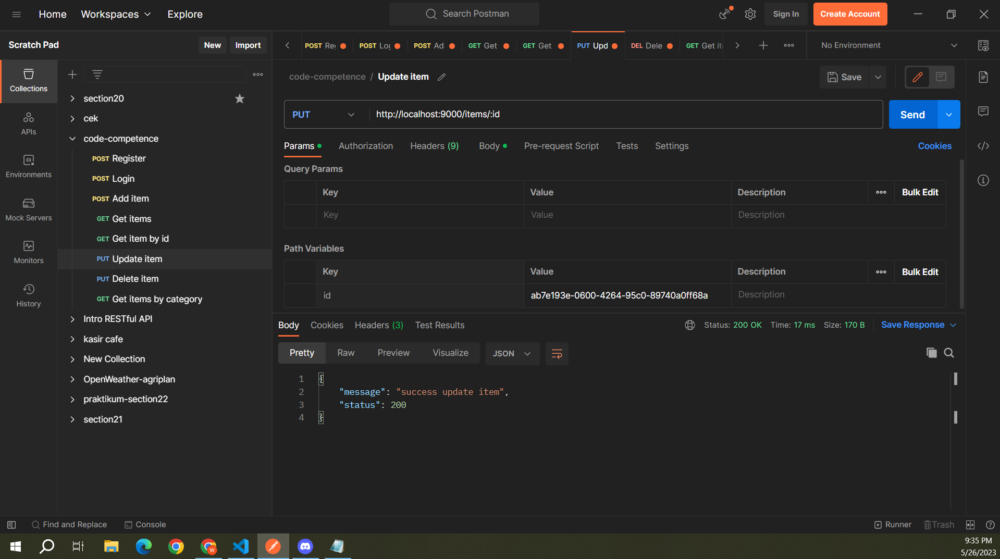
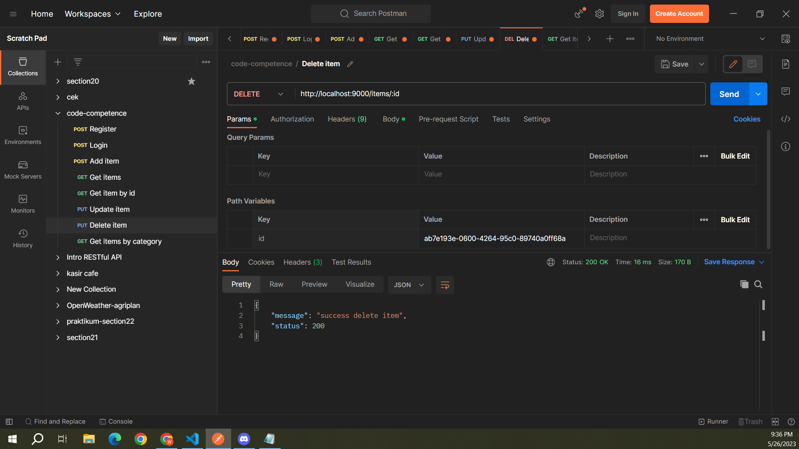
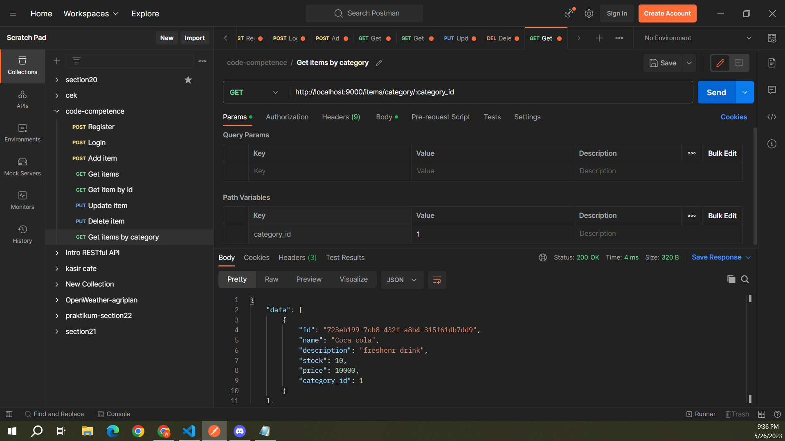

# Remidial Code Competence
by Widho Faisal Hakim

- Strukture code (MVC)
   
  
   

- Register
   
  
   

- Login
   
  
   

- Add item1
   
  
   

- Add item2
   
  
   

- Get items
   
  
   

- Get items by name1
   
  
   

- Get items by name2
   
  
   

- Get item by id
   
  
   

- Update item
   
  
   

- Delete item
   
  
   

- Get items by category
   
  
   

